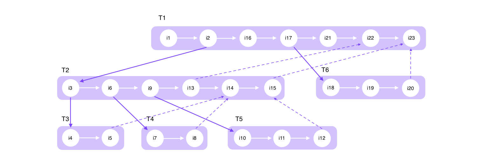

# Work stealing scheduling algorithm

## Work stealing vs work sharing

A scheduling algorithm for the efficient execution of a growing multithreaded computation on a MIMD (multiple instruction, multiple data) styled computer, must ensure the following:

- Enough threads are active concurrently to keep the processors busy.
- Ensure that the number of these concurrently active threads remains at a certain limit so that memory requirements are not excessive.
- Related threads should be maintained within the same processor if possible to mimimise communication between.

As opposed to work sharing, in which the scheduler attempts to migrate some of the processor's newly created threads to underutilised processors with the goal of distributing work; in work stealing, the underutilised processors take the initiative and try to "steal" threads from other processors.

With this approach, thread migration is much more infrequent as it will only occur if a processor is not busy. Whereas a work sharing scheduler is always migrating threads. This creates a significant amount of overhead.

The result is a randomised work-stealing scheduling algorithm for fully strict (well structured) multithreaded computations.

## "Fully strict" multithreaded computations

In order to understand the concept of "fully strict" multithreaded computation, we'll first look into multithreaded computations. These are composed by a set of threads, each of which is a grouping of unit-time instructions which are ordered in a sequential manner.

- **Dependency edges:** Decide which unit-time instructions should be executed first by connecting and ordering them.
- **Continue edges:** In Figure 1 each shaded block is a thread with circles representing unit-time instructions, and the horizontal edges which are the continue edges represent the sequential ordering.
- **Activation frame:** Chunk of memory allocated for a thread to be able to execute. The unit-time instructions of said thread can use up this memory space to store the values on which they compute.

<!-- TODO: finish summary on this section -->

## Busy leaves property

<!-- TODO: finish summary on this section -->

## Randomised work-stealing algorithm

<!-- TODO: finish summary on this section -->

## Atomic access and recycling game

<!-- TODO: finish summary on this section -->

## Analysis of work-stealing algorithm and conclusion

<!-- TODO: finish summary on this section -->

## References

[Scheduling Multithreaded Computations by Work Stealing](http://supertech.csail.mit.edu/papers/steal.pdf)

[A Review on Multiple Instruction Multiple Data (MIMD) Architecture](https://www.researchgate.net/publication/303822973_A_Review_on_Multiple_Instruction_Multiple_Data_MIMD_Architecture)
